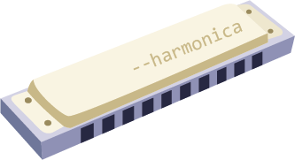

# harmonica [](https://travis-ci.org/shellscape/harmonica)

A module that allows use of Node.js --harmony flags, programmatically.

## &nbsp;
<p align="center">
  <b>:rocket: &nbsp; Are you ready to tackle ES6 and hone your JavaScript Skills?</b> &nbsp; :rocket:<br/>
  Check out these outstanding <a href="https://es6.io/">ES6 courses</a> by <a href="https://github.com/wesbos">@wesbos</a>
</p>
---



Harmonica allows developers to use `--harmony` flags programmatically. That means
an end to specifying command-line options for experimental "harmony" features of
Node.js/V8. If you've ever wanted to use experimental features within Gulp tasks,
or have a need to run an app through wrappers like `forever`, this module takes
the command-line headache out of the equation.


## Node Version Requirements

Harmonica should work with Node.js version 4.6.2 and higher. However, specifying
flags which don't exist for a particular version will likely result in an error.

## Usage

Install the module:

`npm install harmonica`

Initialize the module. By default, harmonica will use the `--harmony` flag,
which will enable all harmony, in-progress features.

```js
require('harmonica')();
```

## Specifying Flags

Should you need only specific flags, pass an `Array` of strings representing the
flags you want to enable, without the leading hyphens, as the first parameter.

```js
require('harmonica')([
  'harmony-array-values',
  'harmony-async-await'
]);
```

## Syntax Flags

Some flags, such as `--harmony-async-await`, enable syntax features in Node.js.
Should you require flags meant to extend the syntax, you must create an entry
point in a separate file from which to initialize harmonica. You can then
`require` the main script for your app, which contains the body of code.

Please see [the tests for an example](https://github.com/shellscape/harmonica/test)
which uses the `async` / `await` syntax.

## Listing Available Flags

If you have the need to view all available harmony flags for your version of node,
you may do so by executing the following in a terminal:

```bash
node --v8-options | grep "in progress"
```

## API

### default([flags], [options])

#### flags

*Optional*  
Type: `Array`  
Default: `undefined`

See [Specifying Flags](#specifying-flags)

#### options

*Optional*  
Type: `Object`  
Default: `{ silent: false }`

Example Usage of all options:

```js
require('harmonica')({ silent: true });
```

Or, if you need to specify flags:

```js
require('harmonica')([
    'harmony-array-values',
    'harmony-async-await'
  ],
  { silent: true });
```

##### silent

Type: `Boolean`  
Default: `false`

Should you wish to silence harmonica's output, set a `silent` property on
`options` to `false`.


## Attribution

[dcodeIO](http://dcode.io/) wrote and published the wonderful
[harmonize](https://github.com/dcodeIO/node-harmonize) module. Harmonica is a
complete rewrite of harmonize, but follows the same principles.

[@stuk](https://twitter.com/stuk) was kind enough to allow me to use the
'harmonica' module name in the NPM registry.

Harmonica vector base by [saicreative](https://www.vecteezy.com/members/saicreative).

## License

MIT © [Andrew Powell](http://shellscape.org)
